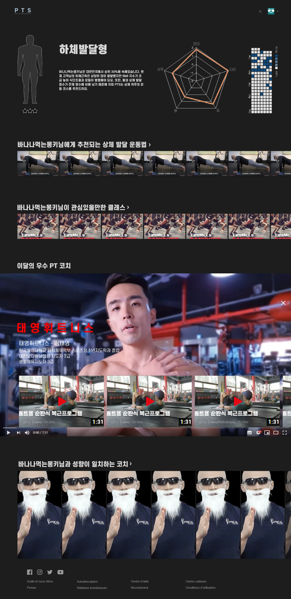

# :muscle: PTS (Personal Training Service) - Sub PJT 2 [2020.09.07 ~ 2020.09.18]
### [PTS 구경하기](http://j3a501.p.ssafy.io/)
## :tophat: 팀소개 (멋쟁이신사)
> #### 팀장 : 오인호 (Back-end)  
> #### 팀원 : 김경재 (Front-end)  
> #### 팀원 : 김세훈 (Front-end)  
> #### 팀원 : 박진 (Back-end)  
> #### 팀원 : 최재빈 (Front-end, Back-end) 

## :page_facing_up: 프로젝트 개요
- 사용자의 운동 성향을 파악하여, 사용자에게 적합한 운동, 클래스, 코치를 추천  
- 체력측정을 통한 사용자의 점수 시각화 제공

## :pager: 와이어프레임

## :computer: 기술 스택
    

## :information_desk_person: 기능

#### [Users : 회원 기능]
- Post
  - 회원가입
  - 로그인
- Get
  - 회원 정보 조회
- Put
  - 회원 정보 수정
- Delete
  - 회원 탈퇴

#### [Measures : 체력측정]
- Post
  - 체력측정 등록
- Get
  - 체력측정 조회

#### [Favorites : 사용자 성향조사]
- Post
  - 성향 등록
- Get
  - 성향 조회

#### [Videos : 영상]
- Post
  - 영상 등록
- Get
  - 영상 조회
  - 영상 필터링
- Put
  - 영상 수정
- Delete
    - 영상 삭제

#### [Classes : 클래스]
- Post
  - 클래스 등록
- Get
  - 클래스 조회
- Put
  - 클래스 수정
- Delete
    - 클래스 삭제

#### [Coaches : 코치]
- Post
  - 코치 신청
  - 코치 등록
- Get
  - 코치 조회
- Put
  - 코치 수정
- Delete
    - 코치 삭제

#### [Silhouettes : 실루엣(마이페이지)]
- Get
  - 잔디 데이터 조회
  - 통계설명 조회
  - 실루엣 조회

#### [Admins : 관리자]
- Get
  - 코치 신청 리스트 조회
  - 코치 리스트 조회